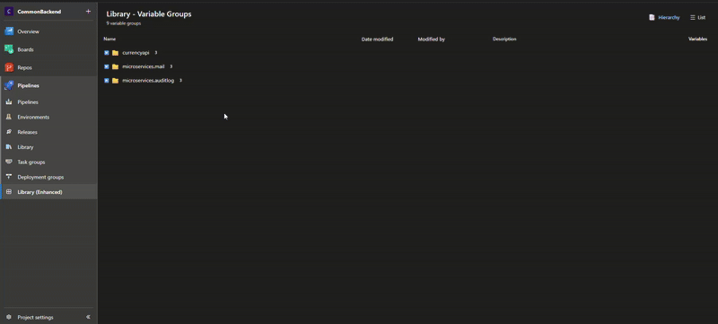

# Azure DevOps Library Enhancer

Enhance your Azure DevOps Library experience with hierarchical variable group organization and improved navigation.



## ✨ Features

### 🌳 Hierarchical Grouping
- Automatically groups Variable Groups by name using `-` delimiter
- Example: `myapp-api-prod`, `myapp-api-test` → grouped under `myapp` > `api`
- Collapsible/Expandable folders for better organization

### 🔗 Enhanced Navigation
- **Left Click**: Navigate to variable group details
- **Right Click** or **Ctrl+Click**: Open in new tab
- **Middle Click**: Open in new tab
- Maintains native Azure DevOps look and feel

*Yes, revolutionary features like "open in new tab" - because apparently Microsoft forgot to implement this in 2025.* 🎉

### 🏷️ Additional Features
- **Copy Variable Group Names**: Hover over any variable group and click the copy icon
- **Dual View Modes**: Switch between hierarchical tree view and flat list view
- **Search and Filter**: Easily find variable groups across your organization
- **Real-time Updates**: Displays modification dates and user information

## 🚀 Getting Started

After installing the extension from the [Visual Studio Marketplace](https://marketplace.visualstudio.com), simply navigate to **Pipelines** → **Library** in your Azure DevOps project. The enhanced library view will automatically replace the default one.

## 🎯 How It Works

The extension:
1. Loads all Variable Groups via Azure DevOps REST API
2. Parses names by `-` character to build hierarchy
3. Renders an interactive tree view with expand/collapse
4. Enables multiple click actions for flexible navigation
5. Provides quick copy functionality for variable group names

## 📊 Example

**Your Variable Groups:**
- `frontend-web-prod`
- `frontend-web-dev`
- `frontend-api-prod`
- `backend-services-prod`
- `backend-database-prod`

**Organized as:**
```
📁 frontend
  📁 web
    📦 prod (5 variables)
    📦 dev (3 variables)
  📁 api
    📦 prod (8 variables)
📁 backend
  📁 services
    📦 prod (12 variables)
  📁 database
    📦 prod (6 variables)
```

---

## 👨</> For Developers

### Local Development Setup

1. **Clone the repository:**
```bash
git clone https://github.com/Milvasoft/azuredevops-library-enhancer.git
cd azuredevops-library-enhancer
```

2. **Install dependencies:**
```bash
npm install
```

3. **Development mode:**
```bash
npm run dev
```

4. **Build for production:**
```bash
npm run build
```

5. **Create extension package:**
```bash
npm run package
```

### Project Structure

```
├── src/
│   ├── components/          # React components
│   │   ├── LibraryHub.tsx   # Main component (production)
│   │   ├── LibraryHubTest.tsx # Test component
│   │   └── HierarchicalTree.tsx # Tree view component
│   ├── services/            # Business logic
│   │   └── VariableGroupService.ts
│   ├── styles/              # CSS files
│   ├── types/               # TypeScript types
│   └── library-hub.tsx      # Entry point
├── dist/                    # Build output
├── images/                  # Extension assets
└── vss-extension.json       # Extension manifest
```

### Testing Locally

1. Build and package the extension
2. Upload to your test marketplace publisher
3. Install to a test Azure DevOps organization
4. Navigate to Library to see changes

For detailed development guidelines, see [DEVELOPER.md](DEVELOPER.md)

### Configuration

Update `vss-extension.json` to customize:
- Extension name and description
- Publisher ID
- Version number
- Permissions and scopes

## 🐛 Troubleshooting

**Extension not appearing?**
- Verify it's enabled in your organization settings
- Clear browser cache and reload
- Check that you have the correct permissions

**Groups not forming correctly?**
- Ensure variable group names use `-` as delimiter
- Check browser console for errors
- Verify API permissions

**Copy button not working?**
- Check browser clipboard permissions
- Try using keyboard shortcuts as fallback

## 🤝 Contributing

We welcome contributions! Here's how:

1. Fork the repository
2. Create feature branch (`git checkout -b feature/amazing-feature`)
3. Commit changes (`git commit -m 'Add amazing feature'`)
4. Push to branch (`git push origin feature/amazing-feature`)
5. Open Pull Request

Please ensure:
- Code follows existing style
- All tests pass
- Documentation is updated

## 📝 License

MIT License - feel free to use and modify.

## 📞 Support

- **Issues**: [GitHub Issues](https://github.com/Milvasoft/azuredevops-library-enhancer/issues)
- **Documentation**: [Developer Guide](DEVELOPER.md)
- **Email**: info@milvasoft.com

## 🔒 Privacy & Security

**Your data is safe.** This is a critical concern for variable groups that often contain sensitive information like API keys, connection strings, and secrets.

### 🛡️ Security Guarantees

- ✅ **100% Open Source**: All code is publicly available on [GitHub](https://github.com/Milvasoft/azuredevops-library-enhancer) for audit
- ✅ **No External Servers**: Extension runs entirely in your browser, no backend services
- ✅ **No Data Transmission**: Zero external API calls or data uploads
- ✅ **Read-Only Access**: Uses `vso.variablegroups_read` scope - cannot modify or delete anything
- ✅ **No Analytics or Tracking**: No telemetry, no usage statistics, no cookies
- ✅ **Local Processing Only**: All grouping and rendering happens client-side in your browser
- ✅ **Microsoft Security Model**: Inherits Azure DevOps' security and permission system

### 🔍 How to Verify

1. Review the [source code](https://github.com/Milvasoft/azuredevops-library-enhancer) yourself
2. Check the extension's permissions in Azure DevOps organization settings
3. Use browser DevTools to verify no external network requests
4. Build and package from source if you prefer

### 🔐 Sensitive Data Handling

- Variable group **values** are never accessed - only names, descriptions, and metadata
- The extension only displays what you already have permission to see
- No clipboard or localStorage usage for sensitive data
- Works within Azure DevOps' existing security context

**Bottom line**: If you can see it in the standard Library view, you can trust it in the enhanced view. If you don't trust it, [audit the code](https://github.com/Milvasoft/azuredevops-library-enhancer).

## ⚠️ Compatibility

- **Azure DevOps Services**: ✅ Fully supported
- **Azure DevOps Server 2019+**: ✅ Supported
- **Browsers**: Chrome, Edge, Firefox, Safari

---

Made with ❤️ by [Milvasoft](https://milvasoft.com)
